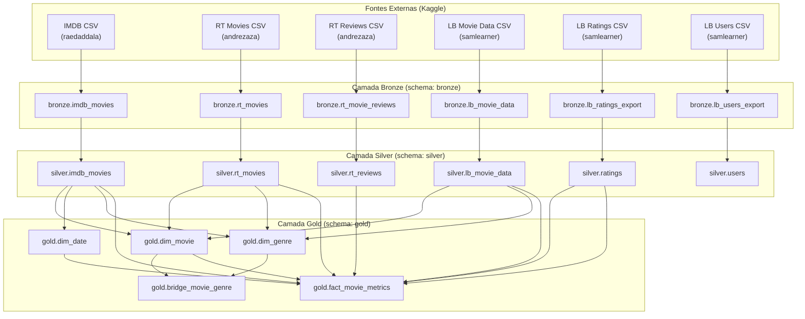

**Instituto Federal de Educação, Ciência e Tecnologia da Bahia
Campus Feira de Santana
Bacharelado em Sistemas de Informação
Sistemas de Apoio à Decisão – Profª Rebeca Barros**

**Grupo:** [Antônio Gabriel, Breno de Souza, Caio Cavalcante, Luan Coelho]
**Tema:** Filmes e críticas

---

# Relatório de Projeto

## 1. Problema de Negócio

O mercado cinematográfico envolve múltiplos agentes com perspectivas distintas sobre um mesmo filme: críticos especializados, público geral, plataformas de avaliação e dados financeiros de bilheteria. Cada plataforma captura uma dimensão diferente do desempenho de um filme, e comparar essas visões de forma integrada não é trivial.

Este projeto constrói um Data Warehouse que consolida dados de três fontes distintas - IMDB, Rotten Tomatoes e Letterboxd - permitindo responder às seguintes perguntas de negócio:

- Como as notas atribuídas pela crítica especializada (RT) e pelo público geral (IMDB, LB) evoluíram ao longo do tempo?
- Quais filmes são considerados os melhores simultaneamente por críticos e público nas três plataformas?
- Quais filmes tiveram o maior retorno financeiro em relação ao orçamento investido?
- Quais gêneros cinematográficos são historicamente mais lucrativos?
- Existe divergência sistemática entre a avaliação da crítica e a do público em determinados gêneros ou períodos?

---

## 2. Fontes de Dados

### 2.1 Visão Geral

| Fonte | Tipo | Origem | Descrição |
|---|---|---|---|
| IMDB Movies | CSV | Kaggle | Dados de filmes com notas, votos, orçamento e bilheteria |
| Rotten Tomatoes Movies & Reviews | CSV | Kaggle | Scores de críticos (Tomatômetro) e público, reviews individuais |
| Letterboxd Movie Ratings Data | CSV | Kaggle | Dados de filmes via TMDB/IMDB, avaliações e usuários da plataforma |

### 2.2 Fonte 1 - IMDB Movies

**Origem:** Kaggle - raedaddala
**Tipo:** CSV
**URL:** https://www.kaggle.com/datasets/raedaddala/top-500-600-movies-of-each-year-from-1960-to-2024
**Data de obtenção:** Setembro de 2026

Contém os 500–600 filmes mais relevantes de cada ano entre 1960 e 2024, extraídos do IMDB. Inclui título, nota, número de votos, Metascore, gêneros, data de lançamento, orçamento, bilheteria mundial e dados de produção. É a principal fonte de dados financeiros do projeto, usada como âncora para integração entre as demais fontes.

### 2.3 Fonte 2 - Rotten Tomatoes Movies & Reviews

**Origem:** Kaggle - andrezaza
**Tipo:** CSV (dois arquivos: filmes e reviews)
**URL:** https://www.kaggle.com/datasets/andrezaza/clapper-massive-rotten-tomatoes-movies-and-reviews
**Data de obtenção:** Setembro de 2026

Contém dois conjuntos: (1) dados agregados por filme com Tomatômetro e Audience Score, classificação indicativa, diretor, gênero e bilheteria; (2) reviews individuais de críticos com score original, sentimento (POSITIVE/NEGATIVE) e texto. É a principal fonte de dados de crítica especializada.

### 2.4 Fonte 3 - Letterboxd Movie Ratings Data

**Origem:** Kaggle - samlearner
**Tipo:** CSV (quatro arquivos: dados de filmes, avaliações, usuários e exportações)
**URL:** https://www.kaggle.com/datasets/samlearner/letterboxd-movie-ratings-data
**Data de obtenção:** Setembro de 2026

Contém dados enriquecidos via API do TMDB para filmes da plataforma Letterboxd, incluindo `imdb_id` como chave de integração. Também contém avaliações individuais de usuários (escala 1–10) e dados de perfil dos usuários. É a principal fonte de dados de engajamento do público geral.

### 2.5 Integração entre as Fontes

As três fontes foram integradas em dois pontos:

**IMDB ↔ Letterboxd:** integração direta via `imdb_id`. A tabela `bronze.lb_movie_data` contém o campo `imdb_id` que referencia diretamente o `id` de `bronze.imdb_movies`. Esta é a integração mais confiável, cobrindo aproximadamente 22% dos filmes do Letterboxd após tratamento de strings vazias.

**IMDB ↔ Rotten Tomatoes:** integração por correspondência de título normalizado (`LOWER(TRIM(title))`), já que o RT não fornece identificadores IMDB. Esta integração cobre aproximadamente 38–39% dos filmes, sendo a mais frágil do pipeline por depender de títulos idênticos entre as fontes.

**Letterboxd Ratings ↔ Letterboxd Movies:** integração via `movie_id` (slug no formato `feast-2014`), campo presente tanto em `bronze.lb_ratings_export` quanto em `bronze.lb_movie_data`.

---

## 3. Linhagem dos Dados (Data Lineage)



---

## 4. Camada Bronze

### 4.1 Objetivo

A camada Bronze é um espelho fiel das fontes originais. Os dados são carregados diretamente dos arquivos CSV sem nenhuma transformação, preservando os tipos e formatos originais - inclusive inconsistências, valores nulos e formatos mistos. Nenhum dado é descartado nesta camada.

### 4.2 Estrutura

| Tabela | Fonte | Registros (aprox.) |
|---|---|---:|
| `bronze.imdb_movies` | IMDB CSV (Kaggle) | 63.249 |
| `bronze.rt_movies` | RT Movies CSV (Kaggle) | 100.000 |
| `bronze.rt_movie_reviews` | RT Reviews CSV (Kaggle) | ~100.000 |
| `bronze.lb_movie_data` | LB Movie Data CSV (Kaggle) | 99.792 |
| `bronze.lb_ratings_export` | LB Ratings CSV (Kaggle) | ~100.000 |
| `bronze.lb_users_export` | LB Users CSV (Kaggle) | ~8.139 |

---

## 5. Camada Silver

### 5.1 Limpeza

| Problema identificado | Tratamento aplicado |
|---|---|
| Coluna `méta_score` com acento no Bronze - erro ao referenciar sem aspas | Referenciada com aspas duplas: `"méta_score"` |
| Colunas camelCase no RT (`criticName`, `isTopCritic`, `originalScore`, `scoreSentiment`, `reviewText`) | Referenciadas com aspas duplas no SELECT do Bronze |
| Colunas camelCase no RT Movies (`audienceScore`, `tomatoMeter`, `boxOffice`) | Referenciadas com aspas duplas; cast via `::TEXT` antes de regex |
| `rating_val` em `lb_ratings_export` armazenado como `text` - pode conter não-numéricos | Filtro via regex `'^[0-9]+(\.[0-9]+)?$'` antes do cast; valores fora de [1–10] descartados |
| `rating` e `méta_score` em `imdb_movies` são `REAL`/`int4` no Bronze - regex não funciona em tipos numéricos | Cast direto (`::DECIMAL`) sem regex |
| `vote_average`, `popularity`, `vote_count`, `runtime` em `lb_movie_data` são numéricos no Bronze | Cast direto sem regex |
| `release_date` em `lb_movie_data` já é `DATE` no Bronze | Cast direto sem regex de formato |
| `rating` em `rt_movies` com 129.267 strings vazias não-NULL | `NULLIF(TRIM(rating), '')` |
| `imdb_id` em `lb_movie_data` com strings vazias não-NULL - impedia JOIN com IMDB | `NULLIF(TRIM(imdb_id::TEXT), '')` |
| `originalScore` com aspas embutidas (`"3.5/4"`) - quebrava cast numérico | Subquery com `REGEXP_REPLACE('[^0-9./]', '', 'g')` antes do CASE |
| `boxOffice` com aspas embutidas e sufixo M/K (`"$31.4M"`) | Subquery remove aspas; CASE trata M×1.000.000 e K×1.000 |
| `budget` com códigos de moeda por extenso (HUF, KRW, EUR) | `REGEXP_REPLACE('[^0-9.]', '', 'g')` remove tudo exceto dígitos |
| `runtime = 0` em `lb_movie_data` - valor inválido | `CASE WHEN runtime = 0 THEN NULL ELSE runtime END` |
| `rt_movies` com ~143.000 linhas na Silver para 100.000 no Bronze (duplicatas) | `DISTINCT ON (id) ... ORDER BY id` na inserção |
| Gêneros em formatos diferentes entre fontes: `['Action']`, `{Action}`, `Action, Drama` | Normalização para `TEXT[]` via `STRING_TO_ARRAY` e `ARRAY_AGG` |
| `genres` em `lb_movie_data` com valores `{}`, `{"null"}` | CASE explícito trata como NULL |

### 5.2 Padronização

| Campo | Transformação |
|---|---|
| `genres` (todas as tabelas) | Normalizado para `TEXT[]` - formato PostgreSQL nativo para arrays |
| `score_numeric` (`rt_reviews`) | Normalizado para escala 0–10: scores fracionários `(X/Y)*10`; `3.5/4` = 8.75, `4/5` = 8.0 |
| `budget_currency` (`imdb_movies`) | Detectada a partir do prefixo do campo `budget` original: `$`→USD, `€`→EUR, `£`→GBP, `₩`→KRW, `HUF...`→HUF |
| `votes` (`imdb_movies`) | Sufixo K multiplicado por 1.000; sufixo M multiplicado por 1.000.000; resultado em `BIGINT` |
| `release_date` (`imdb_movies`) | Validada via regex `'^[0-9]{4}-[0-9]{2}-[0-9]{2}$'` antes do cast para `DATE` |
| `score_sentiment` (`rt_reviews`) | Padronizado para maiúsculas: `UPPER()` |
| Campos textuais ausentes | Mantidos como `NULL` em colunas numéricas/DATE; campos VARCHAR descritivos podem conter `'N/A'` |

### 5.3 Transformações

| Campo origem | Campo destino | Regra |
|---|---|---|
| `bronze.imdb_movies.votes` (text com K/M) | `silver.imdb_movies.votes` (BIGINT) | `REPLACE('K','')*1000` ou `REPLACE('M','')*1000000` com cast explícito |
| `bronze.imdb_movies.budget` (text com símbolo) | `silver.imdb_movies.budget_currency` + `budget` (DECIMAL) | Detecção de moeda por prefixo; remoção de `[^0-9.]` para o valor numérico |
| `bronze.imdb_movies.release_date` (text) | `silver.imdb_movies.release_date` (DATE) + `ano_lancamento`, `mes_lancamento`, `dia_lancamento` (INTEGER) | `EXTRACT(YEAR/MONTH/DAY FROM release_date::DATE)` após validação regex |
| `bronze.rt_movie_reviews.originalScore` (text com aspas) | `silver.rt_reviews.score_numeric` (DECIMAL 5,2) | Limpeza de aspas + normalização `(numerador/denominador)*10` |
| `bronze.lb_movie_data.genres` (_text array PostgreSQL) | `silver.lb_movie_data.genres` (TEXT[]) | `ARRAY_AGG` via `UNNEST + STRING_TO_ARRAY` descartando elementos `null` |
| `bronze.imdb_movies.genres` (text Python list) | `silver.imdb_movies.genres` (TEXT[]) | `STRING_TO_ARRAY` após remoção de `['`, `']`, `'` |
| `bronze.rt_movies.genre` (text CSV) | `silver.rt_movies.genre` (TEXT[]) | `STRING_TO_ARRAY` com normalização de espaços ao redor de vírgulas |

### 5.4 Integração

A integração entre as fontes na camada Silver é feita via chaves naturais preservadas nas tabelas:

- `silver.lb_movie_data.imdb_id` → referencia `silver.imdb_movies.id` (chave IMDB no formato `ttXXXXXXX`)
- `silver.lb_movie_data.movie_id` → referencia `silver.ratings.movie_id` (slug LB no formato `filme-ano`)
- `silver.rt_reviews.id` → é o slug do filme no Rotten Tomatoes, mesmo valor que `silver.rt_movies.id`

O Rotten Tomatoes não integrou muito bem com a tabela do IMDB, mas foram feitas alterações pra tentar fazer ela ligar com essas tabelas

### 5.5 Estrutura Silver

| Tabela | Colunas principais | Tipo |
|---|---|---|
| `silver.ratings` | id, movie_id, rating_val, user_id | rating_val: DECIMAL(3,1) |
| `silver.users` | id, username, display_name, num_ratings_pages, num_reviews | num_*: INTEGER |
| `silver.imdb_movies` | id, title, rating, votes, meta_score, genres, release_date, ano/mes/dia_lancamento, budget_currency, budget, gross_worldwide | genres: TEXT[], financeiros: DECIMAL(15,2) |
| `silver.rt_reviews` | id, critic_name, is_top_critic, original_score, score_numeric, score_sentiment, review_text | score_numeric: DECIMAL(5,2) normalizado 0–10 |
| `silver.rt_movies` | id, title, audience_score, tomato_meter, rating, genre, director, box_office | genre: TEXT[], scores: DECIMAL(5,1) |
| `silver.lb_movie_data` | id, imdb_id, movie_id, movie_title, genres, vote_average, vote_count, release_date, popularity, runtime | genres: TEXT[], vote_average: DECIMAL(4,1) |

---

## 6. Camada Gold - Data Warehouse

### 6.1 Modelo Dimensional

O modelo segue o padrão **Star Schema** com uma tabela fato central e três dimensões, além de uma tabela ponte para o relacionamento N:N entre filmes e gêneros.

```
                    ┌─────────────┐
                    │  dim_genre  │
                    │ genre_sk PK │
                    │ genre_name  │
                    └──────┬──────┘
                           │
                    ┌──────┴──────────┐
                    │ bridge_movie_   │
                    │     genre       │
                    │ movie_sk FK     │
                    │ genre_sk FK     │
                    └──────┬──────────┘
                           │
┌────────────┐    ┌────────┴──────────────┐    ┌──────────────┐
│  dim_date  │    │   fact_movie_metrics   │    │  dim_movie   │
│ date_sk PK │◄───│ movie_sk PK/FK         │───►│ movie_sk PK  │
│ full_date  │    │ release_date_sk FK     │    │ imdb_id      │
│ year       │    │ budget_currency        │    │ rt_id        │
│ quarter    │    │ budget_usd             │    │ lb_movie_id  │
│ month      │    │ gross_worldwide_usd    │    │ title        │
│ day        │    │ profit_usd             │    │ director     │
│ day_of_week│    │ roi                    │    │ mpaa_rating  │
│ year_month │    │ imdb_rating            │    │ runtime      │
└────────────┘    │ imdb_votes             │    └──────────────┘
                  │ imdb_meta_score        │
                  │ rt_tomato_meter        │
                  │ rt_audience_score      │
                  │ rt_review_count        │
                  │ lb_vote_average        │
                  │ lb_vote_count          │
                  │ avg_user_rating        │
                  │ user_rating_count      │
                  └────────────────────────┘
```

### 6.2 Granularidade

A tabela fato `fact_movie_metrics` possui **granularidade de 1 linha por filme**. Cada linha agrega todas as métricas disponíveis para um filme nas três plataformas (IMDB, RT e LB). A chave primária é `movie_sk`, que é simultaneamente FK para `dim_movie` - relação 1:1.

Consequências práticas desta granularidade:
- Métricas de plataformas sem cobertura para um filme aparecem como `NULL` (não como zero)
- `profit_usd` e `roi` são calculados somente quando `budget_currency = 'USD'`, evitando comparações inválidas entre moedas
- `rt_review_count` conta reviews com `score_numeric IS NOT NULL` agrupadas pelo slug do filme

---

## 7. Processo ETL

### 7.1 Fluxo de Execução

```
1. Carga Bronze
   └─ CSVs carregados diretamente para o schema bronze
      sem nenhuma transformação

2. Limpeza e Normalização Silver (load_silver.sql)
   ├─ TRUNCATE de todas as tabelas silver
   ├─ INSERT silver.users       ← bronze.lb_users_export
   ├─ INSERT silver.ratings     ← bronze.lb_ratings_export
   ├─ INSERT silver.imdb_movies ← bronze.imdb_movies
   ├─ INSERT silver.rt_reviews  ← bronze.rt_movie_reviews
   ├─ INSERT silver.rt_movies   ← bronze.rt_movies
   ├─ INSERT silver.lb_movie_data ← bronze.lb_movie_data
   └─ CREATE INDEX (B-tree e GIN para TEXT[])

3. Modelo Dimensional Gold (load_gold.sql)
   ├─ TRUNCATE CASCADE de todas as tabelas gold
   ├─ INSERT gold.dim_date      ← generate_series sobre release_date de silver.imdb_movies
   ├─ INSERT gold.dim_movie     ← silver.imdb_movies + silver.rt_movies + silver.lb_movie_data
   ├─ INSERT gold.dim_genre     ← UNNEST de genres de todas as tabelas silver
   ├─ INSERT gold.bridge_movie_genre ← UNNEST via dim_movie + dim_genre
   ├─ INSERT gold.fact_movie_metrics ← JOINs entre silver.imdb_movies, rt_movies,
   │                                   rt_reviews, lb_movie_data, ratings
   └─ CREATE INDEX
```

### 7.2 Scripts

| Ordem | Script | Entrada | Saída |
|---:|---|---|---|
| 1 | `load_bronze.sql` | Arquivos CSV das 3 fontes Kaggle | 6 tabelas no schema `bronze` |
| 2 | `load_silver.sql` | Schema `bronze` | 6 tabelas limpas e tipadas no schema `silver` |
| 3 | `load_gold.sql` | Schema `silver` | 3 dimensões + 1 ponte + 1 fato no schema `gold` |

---

## 8. Dashboard

### 8.1 Visão Geral

O dashboard é organizado em três painéis temáticos, cada um respondendo a um conjunto de perguntas de negócio. Todos os painéis consultam exclusivamente a camada Gold. Os KPIs financeiros são restritos a filmes com `budget_currency = 'USD'` para garantir comparabilidade.

### 8.2 Painel 1 - Críticas

**Objetivo:** Comparar a evolução das avaliações de críticos especializados (IMDB e RT) ao longo do tempo e identificar os filmes mais bem avaliados simultaneamente por críticos e pelo público geral nas três plataformas.

#### KPIs

| KPI | Definição | Fórmula | Tabelas Gold |
|---|---|---|---|
| Evolução das notas de críticos IMDB ↔ RT | Média anual da nota IMDB e do Tomatômetro RT para identificar tendências da crítica ao longo do tempo | `AVG(imdb_rating)` e `AVG(rt_tomato_meter)` agrupados por `year` | `fact_movie_metrics`, `dim_date` |
| Melhores filmes avaliados por público e críticos LB ↔ IMDB ↔ RT | Ranking dos filmes com melhor desempenho combinado nas três plataformas, considerando nota IMDB, Tomatômetro RT e média LB | Score consolidado = `(imdb_rating + rt_tomato_meter/10 + lb_vote_average) / nº plataformas com dado` | `fact_movie_metrics`, `dim_movie` |

#### Visualizações

- **Gráfico de linha dupla** com eixo temporal (ano): curva da nota média IMDB e curva do Tomatômetro médio RT - permite ver se críticos das duas plataformas convergem ou divergem ao longo das décadas
- **Tabela ranqueada** com os top 20 filmes por score consolidado, exibindo as três notas individualmente lado a lado para facilitar comparação

### 8.3 Painel 2 - Financeiro

**Objetivo:** Analisar o desempenho financeiro dos filmes com orçamento em USD - comparando o total investido com o total arrecadado e identificando os filmes individualmente mais lucrativos.

#### KPIs

| KPI | Definição | Fórmula | Tabelas Gold |
|---|---|---|---|
| Comparação do lucro total × orçamento total | Visão agregada do mercado: quanto foi investido em produção versus quanto foi arrecadado nas bilheterias | `SUM(budget_usd)` vs `SUM(gross_worldwide_usd)` WHERE `budget_currency = 'USD'` | `fact_movie_metrics` |
| Filmes mais lucrativos | Ranking individual dos filmes com maior lucro absoluto | `profit_usd = gross_worldwide_usd - budget_usd` ORDER BY `profit_usd DESC` | `fact_movie_metrics`, `dim_movie` |

#### Visualizações

- **Dois cards de valor agregado** lado a lado: total orçado (soma dos budgets USD) e total arrecadado (soma do gross USD) - com um terceiro card de lucro líquido agregado
- **Gráfico de barras empilhadas ou agrupadas por ano:** evolução do orçamento total versus receita total, mostrando anos em que o mercado operou no lucro ou no prejuízo
- **Tabela ranqueada** com os top 20 filmes mais lucrativos, exibindo título, ano, budget, gross e profit

### 8.4 Painel 3 - Gênero

**Objetivo:** Identificar quais gêneros cinematográficos geram mais receita e maior lucro médio por filme, usando exclusivamente dados financeiros do IMDB em USD.

#### KPIs

| KPI | Definição | Fórmula | Tabelas Gold |
|---|---|---|---|
| Gênero mais lucrativo | Receita bruta total acumulada por gênero - identifica quais categorias dominam a bilheteria | `SUM(gross_worldwide_usd)` GROUP BY `genre_name` WHERE `budget_currency = 'USD'` | `fact_movie_metrics`, `bridge_movie_genre`, `dim_genre` |
| Lucro médio por gênero | Lucro médio por filme dentro de cada gênero - diferencia gêneros de alto volume de gêneros de alta rentabilidade por título | `AVG(profit_usd)` GROUP BY `genre_name` WHERE `budget_currency = 'USD'` | `fact_movie_metrics`, `bridge_movie_genre`, `dim_genre` |

#### Visualizações

- **Gráfico de barras horizontal** com os top 15 gêneros por receita bruta total acumulada
- **Gráfico de barras horizontal** com os top 15 gêneros por lucro médio por filme - a ordem pode diferir da receita total, evidenciando gêneros que rendem mais por produção individual

---

## 9. Divisão das Atividades

_Descreva quais as atividades realizadas por cada integrante do grupo._

- ### [Nome do Integrante]
    - [Descrição das tarefas realizadas pelo integrante]

